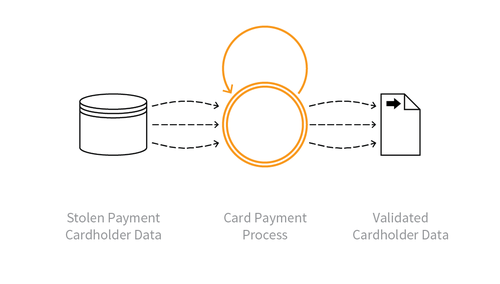

---

layout: col-sidebar
title: OAT-001 Carding
site_side: false
tags: oatsEN
project: true

---

**Carding** is an automated threat. The OWASP Automated Threat Handbook - Web Applications ([pdf](https://github.com/OWASP/www-project-automated-threats-to-web-applications/tree/master/assets/files/EN), [print](http://www.lulu.com/shop/owasp-foundation/automated-threat-handbook/paperback/product-23540699.html)), an output of the [OWASP Automated Threats to Web Applications Project](../../../), provides a fuller guide to each threat, detection methods and countermeasures. The [threat identification chart](https://www.owasp.org/www-project-automated-threats-to-web-applications/assets/files/oat-ontology-decision-chart.pdf) helps to correctly identify the automated threat.

## Definition
### OWASP Automated Threat (OAT) Identity Number
OAT-001

### Threat Event Name
Carding

### Summary Defining Characteristics
Multiple payment authorisation attempts to verify the validity of bulk stolen payment card data.

### Indicative Diagram

### Description
Lists of full credit and/or debit card data are tested against a merchant’s payment processes to identify valid card details. The quality of stolen data is often unknown, and Carding is used to identify good data of higher value. Payment cardholder data may have been stolen from another application, stolen from a different payment channel, or acquired from a criminal marketplace.

When partial cardholder data is available, and the expiry date and/or security code are not known, the process is instead known as [OAT-010 Card Cracking](OAT-010_Card_Cracking.html). The use of stolen cards to obtain cash or goods is [OAT-012 Cashing Out](OAT-012_Cashing_Out.html).

### Other Names and Examples
Card stuffing; Credit card stuffing; Card verification

### See Also
* [OAT-010 Card Cracking](OAT-010_Card_Cracking.html)
* [OAT-012 Cashing Out](OAT-012_Cashing_Out.html)

## Cross-References
### CAPEC Category / Attack Pattern IDs
* 210 Abuse Existing Functionality

### CWE Base / Class / Variant IDs
* 799 Improper Control of Interaction Frequency
* 837 Improper Enforcement of a Single, Unique Action

### WASC Threat IDs
* 21 Insufficient Anti-Automation
* 42 Abuse of Functionality

### OWASP Attack Category / Attack IDs
* Abuse of Functionality

  Return to [OWASP Automated Threats to Web Applications Project](../../../).  
