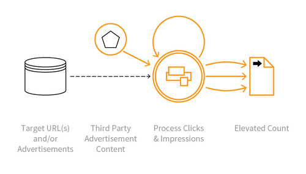

---

layout: col-sidebar
title: OAT-003 Ad Fraud
site_side: false
tags: oatsEN
project: true

---

**Ad Fraud** is an automated threat. The OWASP Automated Threat Handbook - Web Applications ([pdf](https://github.com/OWASP/www-project-automated-threats-to-web-applications/tree/master/assets/files/EN), [print](http://www.lulu.com/shop/owasp-foundation/automated-threat-handbook/paperback/product-23540699.html)), an output of the [OWASP Automated Threats to Web Applications Project](../../../), provides a fuller guide to each threat, detection methods and countermeasures. The [threat identification chart](https://www.owasp.org/www-project-automated-threats-to-web-applications/assets/files/oat-ontology-decision-chart.pdf) helps to correctly identify the automated threat.

## Definition
### OWASP Automated Threat (OAT) Identity Number
OAT-003

### Threat Event Name
Ad Fraud

### Summary Defining Characteristics
False clicks and fraudulent display of web-placed advertisements.

### Indicative Diagram

### Description
Falsification of the number of times an item such as an advert is clicked on, or the number of times an advertisement is displayed. Performed by owners of web sites displaying ads, competitors and vandals.

See [OAT-016 Skewing](OAT-016_Skewing.html) instead for similar activity that does not involve web-placed advertisements.

### Other Names and Examples
Advert fraud; Adware traffic; Click bot; Click fraud; Hit fraud; Impression fraud; Pay per click advertising abuse; Phoney ad traffic

### See Also
* [OAT-016 Skewing](OAT-016_Skewing.html)
* [OAT-017 Spamming](OAT-017_Spamming.html)

## Cross-References
### CAPEC Category / Attack Pattern IDs
* 210 Abuse Existing Functionality

### CWE Base / Class / Variant IDs
* 799 Improper Control of Interaction Frequency
* 841 Improper Enforcement of Behavioural Workflow

### WASC Threat IDs
* 21 Insufficient Anti-Automation
* 42 Abuse of Functionality

### OWASP Attack Category / Attack IDs
* Abuse of Functionality

  Return to [OWASP Automated Threats to Web Applications Project](../../../).  
