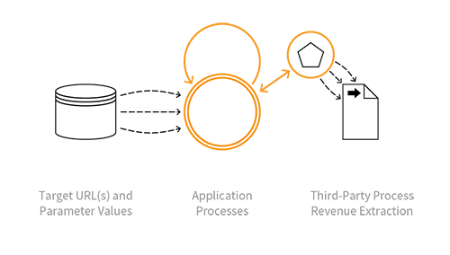

---

layout: col-sidebar
title: OAT-003 Cost-Inflation Fraud
site_side: false
tags: oatsEN
project: true

---

**Cost-Inflation Fraud** is an automated threat. The OWASP Automated Threat Handbook - Web Applications ([pdf](https://github.com/OWASP/www-project-automated-threats-to-web-applications/tree/master/assets/files/EN), [print](http://www.lulu.com/shop/owasp-foundation/automated-threat-handbook/paperback/product-23540699.html)), an output of the [OWASP Automated Threats to Web Applications Project](../../../), provides a fuller guide to each threat, detection methods and countermeasures. The [threat identification chart](https://www.owasp.org/www-project-automated-threats-to-web-applications/assets/files/oat-ontology-decision-chart.pdf) helps to correctly identify the automated threat.

## Definition
### OWASP Automated Threat (OAT) Identity Number
OAT-003

### Threat Event Name
Cost-Inflation Fraud

### Summary Defining Characteristics
Mass use of functionality to illegitimately profit from chargeable supporting services.

### Indicative Diagram

### Description
Use of features which utilise some third-party provided services including API usage events (e.g. mapping, search, AI calls, messaging), pay per access (e.g. documents, research, data), advertising/affiliate marketing (e.g. click-throughs, advert views), and performance-related payment for a service (e.g. SEO). These interactions inflate charges billed by the relevant service provider. The attack depends on the service provider (or an employee, agent, intermediary, etc) also acting fraudulently or being compromised in some way, so the attacker is the beneficiary of the inflated charges.

See [OAT-016 Skewing](OAT-016_Skewing.html) instead for similar activity that does not involve inflation of charges which benefit the attacker. Prior to v1.3, OAT-003 was named Ad Fraud.

### Other Names and Examples
API usage inflation; Artificially Inflated Traffic (AIT); Advert fraud; Adware traffic; Click bot; Click fraud; Hit fraud; Impression fraud; Pay per click advertising abuse; Phoney ad traffic; SMS pumping; Toll fraud; Transfer pricing

### See Also
* [OAT-016 Skewing](OAT-016_Skewing.html)
* [OAT-017 Spamming](OAT-017_Spamming.html)

## Cross-References
### CAPEC Category / Attack Pattern IDs
* 210 Abuse Existing Functionality

### CWE Base / Class / Variant IDs
* 799 Improper Control of Interaction Frequency
* 841 Improper Enforcement of Behavioural Workflow

### WASC Threat IDs
* 21 Insufficient Anti-Automation
* 42 Abuse of Functionality

### OWASP Attack Category / Attack IDs
* Abuse of Functionality

  Return to [OWASP Automated Threats to Web Applications Project](../../../).  
