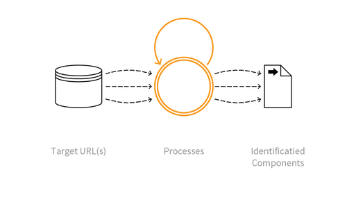

---

layout: col-sidebar
title: OAT-004 Fingerprinting
site_side: false
tags: oatsEN
project: true

---

**Fingerprinting** is an automated threat. The OWASP Automated Threat Handbook - Web Applications ([pdf](https://github.com/OWASP/www-project-automated-threats-to-web-applications/tree/master/assets/files/EN), [print](http://www.lulu.com/shop/owasp-foundation/automated-threat-handbook/paperback/product-23540699.html)), an output of the [OWASP Automated Threats to Web Applications Project](../../../), provides a fuller guide to each threat, detection methods and countermeasures. The [threat identification chart](https://www.owasp.org/www-project-automated-threats-to-web-applications/assets/files/oat-ontology-decision-chart.pdf) helps to correctly identify the automated threat.

## Definition
### OWASP Automated Threat (OAT) Identity Number
OAT-004

### Threat Event Name
Fingerprinting

### Summary Defining Characteristics
Elicit information about the supporting so ware and framework types and versions.

### Indicative Diagram

### Description
Specific requests are sent to the application eliciting information in order to profile the application. This probing typically examines HTTP header names and values, session identifier names and formats, contents of error page messages, URL path case sensitivity, URL path patterns, file extensions, and whether software-specific files and directories exist. Fingerprinting is often reliant on information leakage and this profiling may also reveal some network architecture/topology. The fingerprinting may be undertaken without any direct usage of the application, e.g. by querying a store of exposed application properties such as held in a search engine's index.

Fingerprinting seeks to identity application components, whereas [OAT-018 Footprinting](OAT-018_Footprinting.html) is a more detailed analysis of how the application works.

### Other Names and Examples
Google dorking; Google hacking; Shodaning; Target acquisition; Target scanning; Finding potentially vulnerable applications; Reconnaissance; URL harvesting; Web application fingerprinting

### See Also
* [OAT-011 Scraping](OAT-011_Scraping.html)
* [OAT-018 Footprinting](OAT-018_Footprinting.html)

## Cross-References
### CAPEC Category / Attack Pattern IDs
* 541 Application Fingerprinting
* 170 Web Application Fingerprinting

### CWE Base / Class / Variant IDs
* 200 Information Exposure

### WASC Threat IDs
* 45 Fingerprinting

### OWASP Attack Category / Attack IDs
* -

  Return to [OWASP Automated Threats to Web Applications Project](../../../).  
