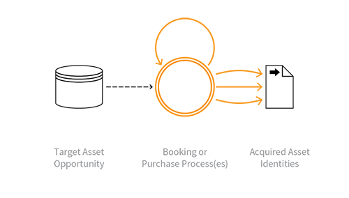

---

layout: col-sidebar
title: OAT-005 Scalping
site_side: false
tags: oatsEN
project: true

---

**Scalping** is an automated threat. The OWASP Automated Threat Handbook - Web Applications ([pdf](https://github.com/OWASP/www-project-automated-threats-to-web-applications/tree/master/assets/files/EN), [print](http://www.lulu.com/shop/owasp-foundation/automated-threat-handbook/paperback/product-23540699.html)), an output of the [OWASP Automated Threats to Web Applications Project](../../../), provides a fuller guide to each threat, detection methods and countermeasures. The [threat identification chart](https://www2.owasp.org/www-project-automated-threats-to-web-applications/assets/files/oat-ontology-decision-chart.pdf) helps to correctly identify the automated threat.

## Definition
### OWASP Automated Threat (OAT) Identity Number
OAT-005

### Threat Event Name
Scalping

### Summary Defining Characteristics
Obtain limited-availability and/or preferred goods/services by unfair methods.

### Indicative Diagram

### Description
Acquisition of goods or services using the application in a manner that a normal user would be unable to undertake manually.

Although Scalping may include monitoring awaiting availability of the goods or services, and then rapid action to beat normal users to obtain these, Scalping is not a "last minute" action like [OAT-013 Sniping](OAT-013_Sniping.html), nor just related to automation on behalf of the user such as in [OAT-006 Expediting](OAT-006_Expediting.html). This is because Scalping includes the additional concept of limited availability of sought-after goods or services, and is most well known in the ticketing business where the tickets acquired are then resold later at a profit by the scalpers/touts. This can also lead to a type of user denial of service, since the goods or services become unavailable rapidly.

### Other Names and Examples
Bulk purchase; Purchase automaton; Purchase bot; Restaurant table/hotel room reservation speed-booking; Queue jumping; Sale stampede; Secondary ticketing; Ticket resale; Ticket scalping; Ticket touting

### See Also
* [OAT-006 Expediting](OAT-006_Expediting.html)
* [OAT-013 Sniping](OAT-013_Sniping.html)
* [OAT-015 Denial of Service](OAT-015_Denial_of_Service.html)
* [OAT-021 Denial of Inventory](OAT-021_Denial_of_Inventory.html)

## Cross-References
### CAPEC Category / Attack Pattern IDs
* 210 Abuse of Functionality

### CWE Base / Class / Variant IDs
* 799 Improper Control of Interaction Frequency
* 837 Improper Enforcement of a Single, Unique Action

### WASC Threat IDs
* 21 Insufficient Anti-Automation
* 42 Abuse of Functionality

### OWASP Attack Category / Attack IDs
* Abuse of Functionality

  Return to [OWASP Automated Threats to Web Applications Project](../../../).  
