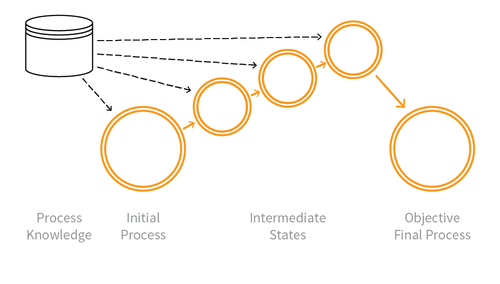

---

layout: col-sidebar
title: OAT-006 Expediting
site_side: false
tags: oatsEN
project: true

---

**Expediting** is an automated threat. The OWASP Automated Threat Handbook - Web Applications ([pdf](https://github.com/OWASP/www-project-automated-threats-to-web-applications/tree/master/assets/files/EN), [print](http://www.lulu.com/shop/owasp-foundation/automated-threat-handbook/paperback/product-23540699.html)), an output of the [OWASP Automated Threats to Web Applications Project](../../../), provides a fuller guide to each threat, detection methods and countermeasures. The [threat identification chart](https://www.owasp.org/www-project-automated-threats-to-web-applications/assets/files/oat-ontology-decision-chart.pdf) helps to correctly identify the automated threat.

## Definition
### OWASP Automated Threat (OAT) Identity Number
OAT-006

### Threat Event Name
Expediting

### Summary Defining Characteristics
Perform actions to hasten progress of usually slow, tedious or time-consuming actions.

### Indicative Diagram

### Description
Using speed to violate explicit or implicit assumptions about the application’s normal use to achieve unfair individual gain, often associated with deceit and loss to some other party.

In contrast to [OAT-016 Skewing](OAT-016_Skewing.html) which affects metrics, Expediting is purely related to faster progression through a series of application processes. And [OAT-017 Spamming](OAT-017_Spamming.html) is different to Expediting, since the focus of spam is to add information, and may not involve the concept of process progression.

### Other Names and Examples
AI agent; Algorithmic trading; Automated stock trading; Betting automation; Game automation; Gaming bot; Gold farming; Financial instrument dealing; High frequency trading; Last look trade; Mining; Purchase automation; Ticketing automation; Trading automation; Virtual wealth generation bot

### See Also
* [OAT-005 Scalping](OAT-005_Scalping.html)
* [OAT-013 Sniping](OAT-013_Sniping.html)
* [OAT-016 Skewing](OAT-016_Skewing.html)
* [OAT-017 Spamming](OAT-017_Spamming.html)

## Cross-References
### CAPEC Category / Attack Pattern IDs
* 210 Abuse Existing Functionality

### CWE Base / Class / Variant IDs
* 841 Improper Enforcement of Behavioral Workflow

### WASC Threat IDs
* 21 Insufficient Anti-Automation
* 42 Abuse of Functionality

### OWASP Attack Category / Attack IDs
* Abuse of Functionality

  Return to [OWASP Automated Threats to Web Applications Project](../../../).  
