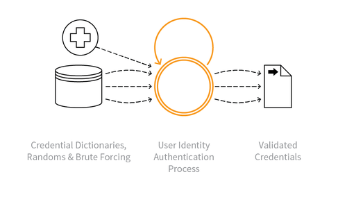

---

layout: col-sidebar
title: OAT-007 Credential Cracking
site_side: false
tags: oatsEN
project: true

---

**Credential Cracking** is an automated threat. The OWASP Automated Threat Handbook - Web Applications ([pdf](https://github.com/OWASP/www-project-automated-threats-to-web-applications/tree/master/assets/files/EN), [print](http://www.lulu.com/shop/owasp-foundation/automated-threat-handbook/paperback/product-23540699.html)), an output of the [OWASP Automated Threats to Web Applications Project](../../../), provides a fuller guide to each threat, detection methods and countermeasures. The [threat identification chart](https://www.owasp.org/www-project-automated-threats-to-web-applications/assets/files/oat-ontology-decision-chart.pdf) helps to correctly identify the automated threat.

## Definition
### OWASP Automated Threat (OAT) Identity Number
OAT-007

### Threat Event Name
Credential Cracking

### Summary Defining Characteristics
Identify valid login credentials by trying different values for usernames and/or passwords.

### Indicative Diagram

### Description
Brute force, dictionary (word list) and guessing attacks used against authentication processes of the application to identify valid account credentials. This may utilise common usernames or passwords, or involve initial username evaluation. It may abuse functionality not always considered authentication directly, such as trying lists of email addresses to register for email subscriptions, on websites where usernames are email addresses.

The use of stolen credential sets (paired username and passwords) to authenticate at one or more services is [OAT-008 Credential Stuffing](OAT-008_Credential_Stuffing.html). Use of processes simply to identify users (e.g. email addresses) for use elsewhere is [OAT-011 Scraping](OAT-011_Scraping.html).

### Other Names and Examples
Brute forcing log-in credentials; Brute-force password cracking; Cracking login credentials; Mailing list stuffing; Password brute-forcing; Password cracking; Password spraying; Reverse brute force attack; Username cracking; Username enumeration

### See Also
* [OAT-002 Token Cracking](OAT-002_Token_Cracking.html)
* [OAT-008 Credential Stuffing](OAT-008_Credential_Stuffing.html)
* [OAT-019 Account Creation](OAT-019_Account_Creation.html)
* [OAT-020 Account Aggregation](OAT-020_Account_Aggregation.html)

## Cross-References
### CAPEC Category / Attack Pattern IDs
* 16 Dictionary-based Password Attack
* 49 Password Brute Forcing
* 70 Try Common or Default Usernames and Passwords
* 112 Brute Force

### CWE Base / Class / Variant IDs
* 307 Improper Restriction of Excessive Authentication Attempts
* 799 Improper Control of Interaction Frequency
* 837 Improper Enforcement of a Single, Unique Action

### WASC Threat IDs
* 11 Brute Force
* 21 Insufficient Anti-Automation
* 42 Abuse of Functionality

### OWASP Attack Category / Attack IDs
* Brute Force Attack
* Password Spraying

  Return to [OWASP Automated Threats to Web Applications Project](../../../).  
