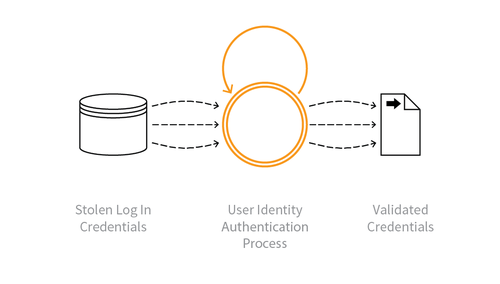

---

layout: col-sidebar
title: OAT-008 Credential Stuffing
site_side: false
tags: oatsEN
project: true

---

**Credential Stuffing** is an automated threat. The OWASP Automated Threat Handbook - Web Applications ([pdf](https://github.com/OWASP/www-project-automated-threats-to-web-applications/tree/master/assets/files/EN), [print](http://www.lulu.com/shop/owasp-foundation/automated-threat-handbook/paperback/product-23540699.html)), an output of the [OWASP Automated Threats to Web Applications Project](../../../), provides a fuller guide to each threat, detection methods and countermeasures. The [threat identification chart](https://www.owasp.org/www-project-automated-threats-to-web-applications/assets/files/oat-ontology-decision-chart.pdf) helps to correctly identify the automated threat.

## Definition
### OWASP Automated Threat (OAT) Identity Number
OAT-008

### Threat Event Name
Credential Stuffing

### Summary Defining Characteristics
Mass log in attempts used to verify the validity of stolen username/password pairs.

### Indicative Diagram

### Description
Lists of authentication credentials stolen from elsewhere are tested against the application’s authentication mechanisms to identify whether users have re-used the same login credentials. The stolen usernames (often email addresses) and password pairs could have been sourced directly from another application by the attacker, purchased in a criminal marketplace, or obtained from publicly available breach data dumps.

Unlike [OAT-007 Credential Cracking](OAT-007_Credential_Cracking.html), Credential Stuffing does not involve any brute-forcing or guessing of values; instead credentials used in other applications are being tested for validity.

### Other Names and Examples
Account checker attack; Account checking; Account takeover; Account takeover attack; Login Stuffing; Password list attack; Password re-use; Stolen credentials; Use of stolen credentials

### See Also
* [OAT-007 Credential Cracking](OAT-007_Credential_Cracking.html)
* [OAT-019 Account Creation](OAT-019_Account_Creation.html)

## Cross-References
### CAPEC Category / Attack Pattern IDs
* 210 Abuse of Functionality

### CWE Base / Class / Variant IDs
* 799 Improper Control of Interaction Frequency
* 837 Improper Enforcement of a Single, Unique Action

### WASC Threat IDs
* 21 Insufficient Anti-Automation
* 42 Abuse of Functionality

### OWASP Attack Category / Attack IDs
* Abuse of Functionality
* Credential Stuffing

  Return to [OWASP Automated Threats to Web Applications Project](../../../).  
