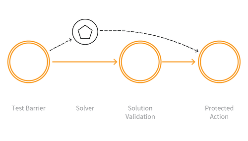

---

layout: col-sidebar
title: OAT-009 CAPTCHA Defeat
site_side: false
tags: oatsEN
project: true

---

**CAPTCHA Defeat** is an automated threat. The OWASP Automated Threat Handbook - Web Applications ([pdf](https://github.com/OWASP/www-project-automated-threats-to-web-applications/tree/master/assets/files/EN), [print](http://www.lulu.com/shop/owasp-foundation/automated-threat-handbook/paperback/product-23540699.html)), an output of the [OWASP Automated Threats to Web Applications Project](../../../), provides a fuller guide to each threat, detection methods and countermeasures. The [threat identification chart](https://www.owasp.org/www-project-automated-threats-to-web-applications/assets/files/oat-ontology-decision-chart.pdf) helps to correctly identify the automated threat.

## Definition
### OWASP Automated Threat (OAT) Identity Number
OAT-009

### Threat Event Name
CAPTCHA Defeat

### Summary Defining Characteristics
Solve anti-automation tests.

### Indicative Diagram

### Description
Completely Automated Public Turing test to tell Computers and Humans Apart (CAPTCHA) challenges are used to distinguish normal users from bots. Automation is used in an attempt to analyse and determine the answer to visual and/or aural CAPTCHA tests and related puzzles. Apart from conventional visual and aural CAPTCHA, puzzle solving mini games or arithmetical exercises are sometimes used. Some of these may include context-specific challenges.

The process that determines the answer may utilise tools to perform optical character recognition, or matching against a prepared database of pre-generated images, or using other machine reading, or human farms.

### Other Names and Examples
Breaking CAPTCHA; CAPTCHA breaker; CAPTCHA breaking; CAPTCHA bypass; CAPTCHA decoding; CAPTCHA solver; CAPTCHA solving; Puzzle solving

### See Also
* [OAT-006 Expediting](OAT-006_Expediting.html)
* [OAT-011 Scraping](OAT-011_Scraping.html)

## Cross-References
### CAPEC Category / Attack Pattern IDs
* -

### CWE Base / Class / Variant IDs
* 804 Guessable CAPTCHA
* 841 Improper Enforcement of Behavioral Workflow

### WASC Threat IDs
* 21 Insufficient Anti-Automation
* 42 Abuse of Functionality

### OWASP Attack Category / Attack IDs
* -

  Return to [OWASP Automated Threats to Web Applications Project](../../../).  
