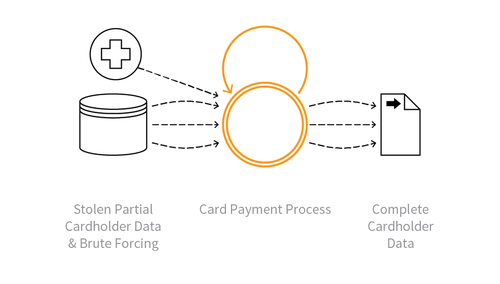

---

layout: col-sidebar
title: OAT-010 Card Cracking
site_side: false
tags: oatsEN
project: true

---

**Card Cracking** is an automated threat. The OWASP Automated Threat Handbook - Web Applications ([pdf](https://github.com/OWASP/www-project-automated-threats-to-web-applications/tree/master/assets/files/EN), [print](http://www.lulu.com/shop/owasp-foundation/automated-threat-handbook/paperback/product-23540699.html)), an output of the [OWASP Automated Threats to Web Applications Project](../../../), provides a fuller guide to each threat, detection methods and countermeasures. The [threat identification chart](https://www.owasp.org/www-project-automated-threats-to-web-applications/assets/files/oat-ontology-decision-chart.pdf) helps to correctly identify the automated threat.

## Definition
### OWASP Automated Threat (OAT) Identity Number
OAT-010

### Threat Event Name
Card Cracking

### Summary Defining Characteristics
Identify missing start/expiry dates and security codes for stolen payment card data by trying different values.

### Indicative Diagram

### Description
Brute force attack against application payment card processes to identify the missing values for start date, expiry date and/or card security code (CSC), also referred to in many ways, including card validation number 2 (CVN2), card validation code (CVC), card verification value (CV2) and card identification number (CID).

When these values are known as well as the Primary Account Number (PAN), [OAT-001_Carding](OAT-001_Carding.html) is used to validate the details, and [OAT-012 Cashing Out](OAT-012_Cashing_Out.html) to obtain goods or cash.

### Other Names and Examples
Brute forcing credit card information; Card brute forcing; Credit card cracking; Distributed guessing attack

### See Also
* [OAT-001_Carding](OAT-001_Carding.html)
* [OAT-012 Cashing Out](OAT-012_Cashing_Out.html)

## Cross-References
### CAPEC Category / Attack Pattern IDs
* 112 Brute Force
* 210 Abuse of Functionality

### CWE Base / Class / Variant IDs
* 799 Improper Control of Interaction Frequency
* 837 Improper Enforcement of a Single, Unique Action

### WASC Threat IDs
* 11 Brute Force
* 21 Insufficient Anti-Automation
* 42 Abuse of Functionality

### OWASP Attack Category / Attack IDs
* Abuse of Functionality
* Brute Force Attack

  Return to [OWASP Automated Threats to Web Applications Project](../../../).  
