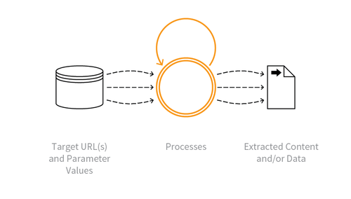

---

layout: col-sidebar
title: OAT-011 Scraping
site_side: false
tags: oatsEN
project: true

---

**Scraping** is an automated threat. The OWASP Automated Threat Handbook - Web Applications ([pdf](https://github.com/OWASP/www-project-automated-threats-to-web-applications/tree/master/assets/files/EN), [print](http://www.lulu.com/shop/owasp-foundation/automated-threat-handbook/paperback/product-23540699.html)), an output of the [OWASP Automated Threats to Web Applications Project](../../../), provides a fuller guide to each threat, detection methods and countermeasures. The [threat identification chart](https://www.owasp.org/www-project-automated-threats-to-web-applications/assets/files/oat-ontology-decision-chart.pdf) helps to correctly identify the automated threat.

## Definition
### OWASP Automated Threat (OAT) Identity Number
OAT-011

### Threat Event Name
Scraping

### Summary Defining Characteristics
Collect application content and/or other data for use elsewhere.

### Indicative Diagram

### Description
Collecting/copying accessible data and/or processed output, for subsequent use such as exploitation of proprietary data, or price-fixing. Some scraping may use fake or compromised accounts, or the information may be accessible without authentication. The scraper may attempt to read all accessible paths and parameter values for web pages and APIs, collecting the responses and extracting data from them. Scraping may occur in real time, or be more periodic in nature. Scraping can be used to gain insight into design/operation - perhaps for cryptanalysis, reverse engineering, or session analysis.

When another application is being used as an intermediary between the user(s) and the real application, see [OAT-020 Account Aggregation](OAT-020_Account_Aggregation.html). If the intent is to obtain cash or goods, see [OAT-012 Cashing Out](OAT-012_Cashing_Out.html) instead.

### Other Names and Examples
AI RAG bot; API provisioning; Bargain hunting; Comparative shopping; Content scraping; Data aggregation; Database scraping; Farming; Harvesting; LLM/AI scraper; LLM training bot; Meta search scraper; Mining; Mirroring; Pagejacking; Ripping; Screen scraping; Subscriber snooping; Web crawler

### See Also
* [OAT-012 Cashing Out](OAT-012_Cashing_Out.html)
* [OAT-018 Footprinting](OAT-018_Footprinting.html)
* [OAT-020 Account Aggregation](OAT-020_Account_Aggregation.html)

## Cross-References
### CAPEC Category / Attack Pattern IDs
* 210 Abuse Existing Functionality

### CWE Base / Class / Variant IDs
* 799 Improper Control of Interaction Frequency

### WASC Threat IDs
* 21 Insufficient Anti-Automation
* 42 Abuse of Functionality

### OWASP Attack Category / Attack IDs
* Abuse of Functionality

  Return to [OWASP Automated Threats to Web Applications Project](../../../).  
