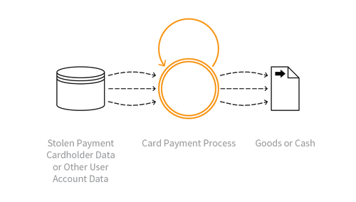

---

layout: col-sidebar
title: OAT-012 Cashing Out
site_side: false
tags: oatsEN
project: true

---

**Cashing Out** is an automated threat. The OWASP Automated Threat Handbook - Web Applications ([pdf](https://github.com/OWASP/www-project-automated-threats-to-web-applications/tree/master/assets/files/EN), [print](http://www.lulu.com/shop/owasp-foundation/automated-threat-handbook/paperback/product-23540699.html)), an output of the [OWASP Automated Threats to Web Applications Project](../../../), provides a fuller guide to each threat, detection methods and countermeasures. The [threat identification chart](https://www2.owasp.org/www-project-automated-threats-to-web-applications/assets/files/oat-ontology-decision-chart.pdf) helps to correctly identify the automated threat.

## Definition
### OWASP Automated Threat (OAT) Identity Number
OAT-012

### Threat Event Name
Cashing Out

### Summary Defining Characteristics
Buy goods or obtain cash utilising validated stolen payment card or other user account data.

### Indicative Diagram

### Description
Obtaining currency or higher-value merchandise via the application using stolen, previously validated payment cards or other account login credentials. Cashing Out sometimes may be undertaken in conjunction with product return fraud. For financial transactions, this is usually a transfer of funds to a mule’s account. For payment cards, this activity may occur following [OAT-001 Carding](OAT-001_Carding.html) of bulk stolen data, or [OAT-010 Card Cracking](OAT-010_Card_Cracking.html), and the goods are dropped at a reshipper's address. The refunding of payments via non-financial applications (e.g. tax refunds, claims payment) is also included in Cashing Out.

Obtaining other information of value from the application is instead [OAT-011 Scraping](OAT-011_Scraping.html).

### Other Names and Examples

### See Also
* [OAT-001 Carding](OAT-001_Carding.html)
* [OAT-010 Card Cracking](OAT-010_Card_Cracking.html)
* [OAT-011 Scraping](OAT-011_Scraping.html)

## Cross-References
### CAPEC Category / Attack Pattern IDs
* 210 Abuse of Functionality

### CWE Base / Class / Variant IDs
* 799 Improper Control of Interaction Frequency
* 837 Improper Enforcement of a Single, Unique Action

### WASC Threat IDs
* 21 Insufficient Anti-Automation
* 42 Abuse of Functionality

### OWASP Attack Category / Attack IDs
* Abuse of Functionality

  Return to [OWASP Automated Threats to Web Applications Project](../../../).  
