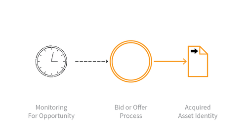

---

layout: col-sidebar
title: OAT-013 Sniping
site_side: false
tags: oatsEN
project: true

---

**Sniping** is an automated threat. The OWASP Automated Threat Handbook - Web Applications ([pdf](https://github.com/OWASP/www-project-automated-threats-to-web-applications/tree/master/assets/files/EN), [print](http://www.lulu.com/shop/owasp-foundation/automated-threat-handbook/paperback/product-23540699.html)), an output of the [OWASP Automated Threats to Web Applications Project](../../../), provides a fuller guide to each threat, detection methods and countermeasures. The [threat identification chart](https://www2.owasp.org/www-project-automated-threats-to-web-applications/assets/files/oat-ontology-decision-chart.pdf) helps to correctly identify the automated threat.

## Definition
### OWASP Automated Threat (OAT) Identity Number
OAT-013

### Threat Event Name
Sniping

### Summary Defining Characteristics
Last minute bid or offer for goods or services.

### Indicative Diagram

### Description
The defining characteristic of Sniping is an action undertaken at the latest opportunity to achieve a particular objective, leaving insufficient time for another user to bid/offer. Sniping can also be the automated exploitation of system latencies in the form of timing attacks. Careful timing and prompt action are necessary parts. It is most well known as auction sniping, but the same threat event can be used in other types of applications. Sniping normally leads to some disbenefit for other users, and sometimes that might be considered a form of denial of service.

In contrast, [OAT-005 Scalping](OAT-005_Scalping.html) is the acquisition of limited availability of sought-after goods or services, and [OAT-006 Expediting](OAT-006_Expediting.html) is the general hastening of progress.

### Other Names and Examples
Auction sniping; Bid sniper; Front- running; Last look; Last minute bet; Timing attack

### See Also
* [OAT-005 Scalping](OAT-005_Scalping.html)
* [OAT-006 Expediting](OAT-006_Expediting.html)
* [OAT-015 Denial of Service](OAT-015_Denial_of_Service.html)
* [OAT-021 Denial of Inventory](OAT-021_Denial_of_Inventory.html)

## Cross-References
### CAPEC Category / Attack Pattern IDs
* 210 Abuse of Functionality

### CWE Base / Class / Variant IDs
* -

### WASC Threat IDs
* 21 Insufficient Anti-Automation
* 42 Abuse of Functionality

### OWASP Attack Category / Attack IDs
* Abuse of Functionality

  Return to [OWASP Automated Threats to Web Applications Project](../../../).  
