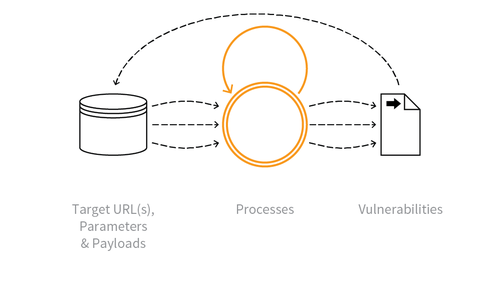

---

layout: col-sidebar
title: OAT-014 Vulnerability Scanning
site_side: false
tags: oatsEN
project: true

---

**Vulnerability Scanning** is an automated threat. The OWASP Automated Threat Handbook - Web Applications ([pdf](https://github.com/OWASP/www-project-automated-threats-to-web-applications/tree/master/assets/files/EN), [print](http://www.lulu.com/shop/owasp-foundation/automated-threat-handbook/paperback/product-23540699.html)), an output of the [OWASP Automated Threats to Web Applications Project](../../../), provides a fuller guide to each threat, detection methods and countermeasures. The [threat identification chart](https://www.owasp.org/www-project-automated-threats-to-web-applications/assets/files/oat-ontology-decision-chart.pdf) helps to correctly identify the automated threat.

## Definition
### OWASP Automated Threat (OAT) Identity Number
OAT-014

### Threat Event Name
Vulnerability Scanning

### Summary Defining Characteristics
Crawl and fuzz application to identify weaknesses and possible vulnerabilities.

### Indicative Diagram

### Description
Systematic enumeration and examination of identifiable, guessable and unknown content locations, paths, file names, parameters, in order to find weaknesses and points where a security vulnerability might exist. Vulnerability Scanning includes both malicious scanning and friendly scanning by an authorised vulnerability scanning engine. It differs from [OAT-011 Scraping](OAT-011_Scraping.html) in that its aim is to identify potential vulnerabilities.

The exploitation of individual vulnerabilities is not included in the scope of this ontology, but this process of scanning, along with [OAT-018 Footprinting](OAT-018_Footprinting.html), [OAT-004 Fingerprinting](OAT-004_Fingerprinting.html) and [OAT-011 Scraping](OAT-011_Scraping.html) often form part of application penetration testing.

### Other Names and Examples
Active/Passive scanning; Application-specific vulnerability discovery; Identifying vulnerable content management systems (CMS) and CMS components; Known vulnerability scanning; Malicious crawling; Vulnerability reconnaissance

### See Also
* [OAT-004 Fingerprinting](OAT-004_Fingerprinting.html)
* [OAT-011 Scraping](OAT-011_Scraping.html)
* [OAT-018 Footprinting](OAT-018_Footprinting.html)

## Cross-References
### CAPEC Category / Attack Pattern IDs
* -

### CWE Base / Class / Variant IDs
* 799 Improper Control of Interaction Frequency
* 841 Improper Enforcement of Behavioral Workflow

### WASC Threat IDs
* 21 Insufficient Anti-Automation

### OWASP Attack Category / Attack IDs
* -

  Return to [OWASP Automated Threats to Web Applications Project](../../../).  
