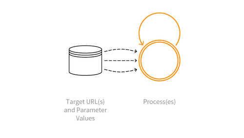

---

layout: col-sidebar
title: OAT-015 Denial of Service
site_side: false
tags: oatsEN
project: true

---

**Denial of Service** is an automated threat. The OWASP Automated Threat Handbook - Web Applications ([pdf](https://github.com/OWASP/www-project-automated-threats-to-web-applications/tree/master/assets/files/EN), [print](http://www.lulu.com/shop/owasp-foundation/automated-threat-handbook/paperback/product-23540699.html)), an output of the [OWASP Automated Threats to Web Applications Project](../../../), provides a fuller guide to each threat, detection methods and countermeasures. The [threat identification chart](https://www2.owasp.org/www-project-automated-threats-to-web-applications/assets/files/oat-ontology-decision-chart.pdf) helps to correctly identify the automated threat.

## Definition
### OWASP Automated Threat (OAT) Identity Number
OAT-015

### Threat Event Name
Denial of Service

### Summary Defining Characteristics
Target resources of the application and database servers, or individual user accounts, to achieve denial of service (DoS).

### Indicative Diagram

### Description
Usage may resemble legitimate application usage, but leads to exhaustion of resources such as file system, memory, processes, threads, CPU, and human or financial resources. The resources might be related to web, application or databases servers or other services supporting the application, such as third party APIs, included third-party hosted content, or content delivery networks (CDNs). The application may be affected as a whole, or the attack may be against individual users such as account lockout.

This ontology’s scope excludes other forms of denial of service that affect web applications, namely HTTP Flood DoS (GET, POST, Header with/without TLS), HTTP Slow DoS, IP layer 3 DoS, and TCP layer 4 DoS. Those protocol and lower layer aspects are covered adequately in other taxonomies and lists.

### Other Names and Examples
Account lockout; App layer DDoS; Asymmetric resource consumption (amplification); Business logic DDoS; Cash overflow; Forced deadlock; Hash DoS; Inefficient code; Indexer DoS; Large files DoS; Resource depletion, locking or exhaustion; Sustained client engagement

### See Also
* [OAT-005 Scalping](OAT-005_Scalping.html)
* [OAT-013 Sniping](OAT-013_Sniping.html)
* [OAT-017 Spamming](OAT-017_Spamming.html)
* [OAT-019 Account Creation](OAT-019_Account_Creation.html)
* [OAT-021 Denial of Inventory](OAT-021_Denial_of_Inventory.html)

## Cross-References
### CAPEC Category / Attack Pattern IDs
* 2 Inducing Account Lockout
* 25 Forced Deadlock
* 119 Deplete Resources

### CWE Base / Class / Variant IDs
* 399 Resource Management Errors
* 645 Overly Restrictive Account Lockout Mechanism

### WASC Threat IDs
* 10 Denial of Service

### OWASP Attack Category / Attack IDs
* Account Lockout Attack
* Cash Overflow
* Denial of Service
* Resource Depletion

  Return to [OWASP Automated Threats to Web Applications Project](../../../).  
