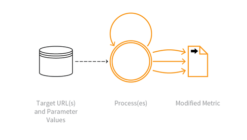

---

layout: col-sidebar
title: OAT-016 Skewing
site_side: false
tags: oatsEN
project: true

---

**Skewing** is an automated threat. The OWASP Automated Threat Handbook - Web Applications ([pdf](https://github.com/OWASP/www-project-automated-threats-to-web-applications/tree/master/assets/files/EN), [print](http://www.lulu.com/shop/owasp-foundation/automated-threat-handbook/paperback/product-23540699.html)), an output of the [OWASP Automated Threats to Web Applications Project](../../../), provides a fuller guide to each threat, detection methods and countermeasures. The [threat identification chart](https://www.owasp.org/www-project-automated-threats-to-web-applications/assets/files/oat-ontology-decision-chart.pdf) helps to correctly identify the automated threat.

## Definition
### OWASP Automated Threat (OAT) Identity Number
OAT-016

### Threat Event Name
Skewing

### Summary Defining Characteristics
Repeated link clicks, page requests or form submissions intended to alter some metric.

### Indicative Diagram

### Description
Automated repeated clicking or requesting or submitting content, a ecting application-based metrics such as counts and measures of frequency and/or rate, some of which may have wider societal meaning. The metric or measurement may be visible to users (e.g. betting odds, likes, market/ dynamic pricing, visitor count, poll results, reviews) or hidden (e.g. application usage statistics, business performance indicators). Metrics may affect individuals/organisations as well as the application owner, e.g. alter user reputation, amplify viewpoints, spread illegal content, influence others, gain fame, or undermine someone else's reputation.

For malicious alteration of digital advertisement metrics, see [OAT-003 Ad Fraud](OAT-003_Ad_Fraud.html).

### Other Names and Examples
AI bot; Analytics poisoning; Biasing KPIs; Boosting friends/likes; Click fraud; Dynamic pricing hacking; Election fraud; Hit count fraud; Market distortion; Metric and statistic skewing; Page impression fraud; Poll/rating/review fraud; SEO; Stock manipulation; Survey skewing; Synthetic social media influence

### See Also
* [OAT-003 Ad Fraud](OAT-003_Ad_Fraud.html)
* [OAT-017 Spamming](OAT-017_Spamming.html)
* [OAT-019 Account Creation](OAT-019_Account_Creation.html)

## Cross-References
### CAPEC Category / Attack Pattern IDs
* 210 Abuse Existing Functionality

### CWE Base / Class / Variant IDs
* 799 Improper Control of Interaction Frequency
* 837 Improper Enforcement of a Single, Unique Action

### WASC Threat IDs
* 21 Insufficient Anti-Automation
* 42 Abuse of Functionality

### OWASP Attack Category / Attack IDs
* Abuse of Functionality

  Return to [OWASP Automated Threats to Web Applications Project](../../../).  
