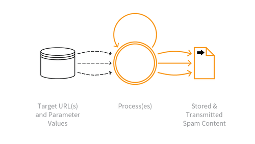

---

layout: col-sidebar
title: OAT-017 Spamming
site_side: false
tags: oatsEN
project: true

---

**Spamming** is an automated threat. The OWASP Automated Threat Handbook - Web Applications ([pdf](https://github.com/OWASP/www-project-automated-threats-to-web-applications/tree/master/assets/files/EN), [print](http://www.lulu.com/shop/owasp-foundation/automated-threat-handbook/paperback/product-23540699.html)), an output of the [OWASP Automated Threats to Web Applications Project](../../../), provides a fuller guide to each threat, detection methods and countermeasures. The [threat identification chart](https://www.owasp.org/www-project-automated-threats-to-web-applications/assets/files/oat-ontology-decision-chart.pdf) helps to correctly identify the automated threat.

## Definition
### OWASP Automated Threat (OAT) Identity Number
OAT-017

### Threat Event Name
Spamming

### Summary Defining Characteristics
Malicious or questionable information addition to public or private content, or messages.

### Indicative Diagram

### Description
Malicious content can include malware, IFRAME distribution, photographs & videos, advertisements, stolen intellectual property, referrer spam and tracking/surveillance code. The content might be less overtly malicious but be an attempt to cause mischief, undertake search engine optimisation (SEO) or to dilute/hide other posts.

The mass abuse of broken form-to-email and form-to-SMS functions to send messages to unintended recipients is not included in this threat event, or any other in this ontology, since those are considered to be the exploitation of implementation flaws alone. For multiple use to inflate billable traffic, see OAT-003 ???. For multiple use that distorts metrics, see [OAT-016 Skewing](OAT-016_Skewing.html) instead.

### Other Names and Examples
AI generated content; Blog spam; Bulletin board spam; Click-bait; Comment spam; Content spam; Content spoofing; Fake news; Form spam; Forum spam; Referrer spam; Reply bot; Review spam; SEO spam; Social media bot; Spambot; Sythetic media; Wiki spam

### See Also
* OAT-003 ???
* [OAT-015 Denial of Service](OAT-015_Denial_of_Service.html)
* [OAT-016 Skewing](OAT-016_Skewing.html)
* [OAT-019 Account Creation](OAT-019_Account_Creation.html)

## Cross-References
### CAPEC Category / Attack Pattern IDs
* 210 Abuse Existing Functionality

### CWE Base / Class / Variant IDs
* 799 Improper Control of Interaction Frequency
* 837 Improper Enforcement of a Single, Unique Action

### WASC Threat IDs
* 21 Insufficient Anti-Automation
* 42 Abuse of Functionality

### OWASP Attack Category / Attack IDs
* Abuse of Functionality

  Return to [OWASP Automated Threats to Web Applications Project](../../../).  
