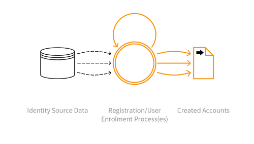

---

layout: col-sidebar
title: OAT-019 Account Creation
site_side: false
tags: oatsEN
project: true

---

**Account Creation** is an automated threat. The OWASP Automated Threat Handbook - Web Applications ([pdf](https://github.com/OWASP/www-project-automated-threats-to-web-applications/tree/master/assets/files/EN), [print](http://www.lulu.com/shop/owasp-foundation/automated-threat-handbook/paperback/product-23540699.html)), an output of the [OWASP Automated Threats to Web Applications Project](../../../), provides a fuller guide to each threat, detection methods and countermeasures. The [threat identification chart](https://www.owasp.org/www-project-automated-threats-to-web-applications/assets/files/oat-ontology-decision-chart.pdf) helps to correctly identify the automated threat.

## Definition
### OWASP Automated Threat (OAT) Identity Number
OAT-019

### Threat Event Name
Account Creation

### Summary Defining Characteristics
Create multiple accounts for subsequent misuse.

### Indicative Diagram

### Description
Bulk account creation, and sometimes profile population, by using the application's account sign-up processes. The accounts are subsequently misused for generating content spam, laundering cash and goods, spreading malware, a ecting reputation, causing mischief, and skewing search engine optimisation (SEO), reviews and surveys.

Account Creation generates new accounts - see [OAT-007 Credential Cracking](OAT-007_Credential_Cracking.html) and [OAT-008 Credential Stuffing](OAT-008_Credential_Stuffing.html) for threat events that use existing accounts.

### Other Names and Examples
Account pharming; Fake account; Fake social media account creation; Impersonator bot; Massive account registration; New account creation; Registering many user accounts

### See Also
* [OAT-007 Credential Cracking](OAT-007_Credential_Cracking.html)
* [OAT-008 Credential Stuffing](OAT-008_Credential_Stuffing.html)

## Cross-References
### CAPEC Category / Attack Pattern IDs
* 210 Abuse of Functionality

### CWE Base / Class / Variant IDs
* 799 Improper Control of Interaction Frequency
* 837 Improper Enforcement of a Single, Unique Action
* 841 Improper Enforcement of Behavioral Workflow

### WASC Threat IDs
* 21 Insufficient Anti-Automation
* 42 Abuse of Functionality

### OWASP Attack Category / Attack IDs
* Abuse of Functionality

  Return to [OWASP Automated Threats to Web Applications Project](../../../).  
