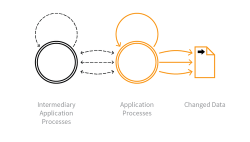

---

layout: col-sidebar
title: OAT-020 Account Aggregation
site_side: false
tags: oatsEN
project: true

---

This is an automated threat. The OWASP Automated Threat Handbook - Web Applications ([pdf](https://github.com/OWASP/www-project-automated-threats-to-web-applications/tree/master/assets/files/EN), [print](http://www.lulu.com/shop/owasp-foundation/automated-threat-handbook/paperback/product-23540699.html)), an output of the [OWASP Automated Threats to Web Applications Project](../../../), provides a fuller guide to each threat, detection methods and countermeasures. The [threat identification chart](https://www2.owasp.org/www-project-automated-threats-to-web-applications/assets/files/oat-ontology-decision-chart.pdf) helps to correctly identify the automated threat.

## Definition
### OWASP Automated Threat (OAT) Identity Number
OAT-020

### Threat Event Name
Account Aggregation

### Summary Defining Characteristics
Use by an intermediary application that collects together multiple accounts and interacts on their behalf.

### Indicative Diagram

### Description
Compilation of credentials and information from multiple application accounts into another system. This aggregation application may be used by a single user to merge information from multiple applications, or alternatively to merge information of many users of a single application. Commonly used for aggregating social media accounts, email accounts and financial accounts in order to obtain a consolidated overview, to provide integrated reporting and analysis, and to simplify usage and consumption by the user and/or their professional advisors. May include making changes to account properties and interacting with the aggregated application's functionality.

For other forms of data harvesting, including the distribution of content, see [OAT-011 Scraping](OAT-011_Scraping.html). For hastening progress, see [OAT-006 Expediting](OAT-006_Expediting.html) instead.

### Other Names and Examples
Aggregator; Brokering; Client aggregator; Cloud services brokerage; Data aggregation; Financial account aggregator; Intermediarisation; Intermediation

### See Also
* [OAT-006 Expediting](OAT-006_Expediting.html)
* [OAT-011 Scraping](OAT-011_Scraping.html)
* [OAT-019 Account Creation](OAT-019_Account_Creation.html)

## Cross-References
### CAPEC Category / Attack Pattern IDs
* 167 Lifting Sensitive Data from the Client
* 210 Abuse of Functionality
* CWE Base / Class / Variant IDs
* 799 Improper Control of Interaction Frequency

### WASC Threat IDs
* 21 Insufficient Anti-Automation
* 42 Abuse of Functionality

### OWASP Attack Category / Attack IDs
* Abuse of Functionality

   Return to [OWASP Automated Threats to Web Applications Project](../../../).
