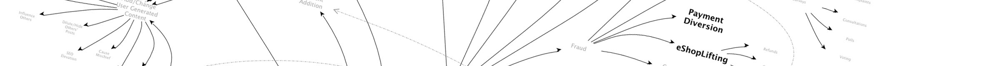

---

layout: col-sidebar
title: OWASP Automated Threats to Web Applications
site_side: true
tags: oat
project: true
level: 3
type: documentation

---

The OWASP Automated Threats to Web Applications Project has completed a review of reports, academic and other papers, news stories and vulnerability taxonomies/listings to identify, name and classify these scenarios – automated by software causing a divergence from accepted behavior producing one or more undesirable effects on a web application, but excluding tool-based exploitation of single-issue vulnerabilities. The initial objective was to produce an ontology providing a common language for developers, architects, operators, business owners, security engineers, purchasers and suppliers/ vendors, to facilitate clear communication and help tackle the issues. The project also identifies symptoms, mitigations and controls in this problem area. Like all OWASP outputs, everything is free and published using an open source license.

## Description

Web applications are subjected to unwanted automated usage – day in, day out. Often these events relate to misuse of inherent valid functionality, rather than the attempted exploitation of unmitigated vulnerabilities. Also, excessive misuse is commonly mistakenly reported as application denial-of-service (DoS) like HTTP-flooding, when in fact the DoS is a side-effect instead of the primary intent. Frequently these have sector-specific names. Most of these problems seen regularly by web application owners are not listed in any OWASP Top Ten or other top issue list. Furthermore, they are not enumerated or defined adequately in existing dictionaries. These factors have contributed to inadequate visibility, and an inconsistency in naming such threats, with a consequent lack of clarity in attempts to address the issues.

Without sharing a common language between devops, architects, business owners, security engineers, purchasers and suppliers/vendors, everyone has to make extra effort to communicate clearly. Misunderstandings can be costly. The adverse impacts affect the privacy and security of individuals as well as the security of the applications and related system components.

## Automated Threats

The list of threat events, defined more fully in the [OWASP Automated Threat Handbook](https://github.com/OWASP/www-project-automated-threats-to-web-applications/tree/master/assets/files/EN), is alphabetically:

* [OAT-020 Account Aggregation](assets/oats/EN/OAT-020_Account_Aggregation.html)
* [OAT-019 Account Creation](assets/oats/EN/OAT-019_Account_Creation.html)
* [OAT-003 Ad Fraud](assets/oats/EN/OAT-003_Ad_Fraud.html)
* [OAT-009 CAPTCHA Defeat](assets/oats/EN/OAT-009_CAPTCHA_Defeat.html)
* [OAT-010 Card Cracking](assets/oats/EN/OAT-010_Card_Cracking.html)
* [OAT-001 Carding](assets/oats/EN/OAT-001_Carding.html)
* [OAT-012 Cashing Out](assets/oats/EN/OAT-012_Cashing_Out.html)
* [OAT-007 Credential Cracking](assets/oats/EN/OAT-007_Credential_Cracking.html)
* [OAT-008 Credential Stuffing](assets/oats/EN/OAT-008_Credential_Stuffing.html)
* [OAT-021 Denial of Inventory](assets/oats/EN/OAT-021_Denial_of_Inventory.html)
* [OAT-015 Denial of Service](assets/oats/EN/OAT-015_Denial_of_Service.html)
* [OAT-006 Expediting](assets/oats/EN/OAT-006_Expediting.html)
* [OAT-004 Fingerprinting](assets/oats/EN/OAT-004_Fingerprinting.html)
* [OAT-018 Footprinting](assets/oats/EN/OAT-018_Footprinting.html)
* [OAT-005 Scalping](assets/oats/EN/OAT-005_Scalping.html)
* [OAT-011 Scraping](assets/oats/EN/OAT-011_Scraping.html)
* [OAT-016 Skewing](assets/oats/EN/OAT-016_Skewing.html)
* [OAT-013 Sniping](assets/oats/EN/OAT-013_Sniping.html)
* [OAT-017 Spamming](assets/oats/EN/OAT-017_Spamming.html)
* [OAT-002 Token Cracking](assets/oats/EN/OAT-002_Token_Cracking.html)
* [OAT-014 Vulnerability Scanning](assets/oats/EN/OAT-014_Vulnerability_Scanning.html)

Not sure which is which? Use the [threat identification chart](assets/files/oat-ontology-decision-chart.pdf) in conjunction with the [full handbook](https://github.com/OWASP/www-project-automated-threats-to-web-applications/tree/master/assets/files/EN).

## Licensing

All the materials are free to use. They are licensed under the [Creative Commons Attribution-ShareAlike 3.0 license](http://creativecommons.org/licenses/by-sa/3.0/), so you can copy, distribute and transmit the work, and you can adapt it, and use it commercially, but all provided that you attribute the work and if you alter, transform, or build upon this work, you may distribute the resulting work only under the same or similar license to this one.

© OWASP Foundation

