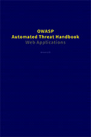
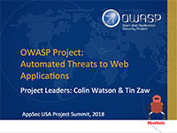

### Quick Links
* [Download the free handbook as a PDF](https://github.com/OWASP/www-project-automated-threats-to-web-applications/tree/master/assets/files/EN) 

### What Is This?
* Information and resources to help web application owners defend against automated threats

### What Isn't It?
* Not another vulnerability list
* Not an OWASP Top N List
* Not threat modelling
* Not attack trees
* Not non-web
* Not non-application

### Project Objective

This project brings together research and analysis of real world automated attacks against web applications, to produce documentation to assist operators defend against these threats. Sector-specific guidance will be available.

### Project Information

* <i class="fas fa-flask" style="font-size: 1.2em; color:#FFA500;"></i>Lab Project
* <i class="fas fa-book" style="font-size: 1.2em; color:#233e81;"></i>Documentation
* <i class="fas fa-tools" style="font-size: 1.2em; color:#233e81;"></i>Builder 
* <i class="fas fa-shield-alt" style="font-size: 1.2em; color:#233e81;"></i>Defender

### Presentation
* 

### License

* 
