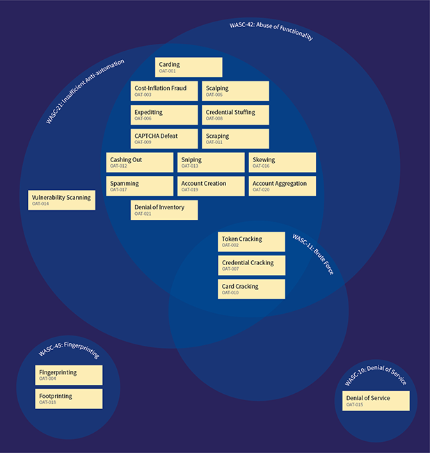

## Ontology

### Introduction

The A-Z list of automated threat events and summary descriptions, defined in full in the [OWASP Automated Threat Handbook](https://github.com/OWASP/www-project-automated-threats-to-web-applications/tree/master/assets/files/EN), is:

OAT Identity / Name | Summary Defining Characteristics
--------------------|-----------------------------------
[OAT-020 Account Aggregation](assets/oats/EN/OAT-020_Account_Aggregation.html) | Use by an intermediary application that collects together multiple accounts and interacts on their behalf
[OAT-019 Account Creation](assets/oats/EN/OAT-019_Account_Creation.html) | Create multiple accounts for subsequent misuse
[OAT-003 Ad Fraud](assets/oats/EN/OAT-003_Ad_Fraud.html) | False clicks and fraudulent display of web-placed advertisements
[OAT-009 CAPTCHA Defeat](assets/oats/EN/OAT-009_CAPTCHA_Defeat.html) | Solve anti-automation tests
[OAT-010 Card Cracking](assets/oats/EN/OAT-010_Card_Cracking.html) | Identify missing start/expiry dates and security codes for stolen payment card data by trying different values
[OAT-001 Carding](assets/oats/EN/OAT-001_Carding.html) | Multiple payment authorisation attempts used to verify the validity of bulk stolen payment card data
[OAT-012 Cashing Out](assets/oats/EN/OAT-012_Cashing_Out.html) | Buy goods or obtain cash utilising validated stolen payment card or other user account data
[OAT-007 Credential Cracking](assets/oats/EN/OAT-007_Credential_Cracking.html) | Identify valid login credentials by trying different values for usernames and/or passwords
[OAT-008 Credential Stuffing](assets/oats/EN/OAT-008_Credential_Stuffing.html) | Mass log in attempts used to verify the validity of stolen username/password pairs
[OAT-021 Denial of Inventory](assets/oats/EN/OAT-021_Denial_of_Inventory.html) | Deplete goods or services stock without ever completing the purchase or committing to the transaction
[OAT-015 Denial of Service](assets/oats/EN/OAT-015_Denial_of_Service.html) | Target resources of the application and database servers, or individual user accounts, to achieve denial of service (DoS)
[OAT-006 Expediting](assets/oats/EN/OAT-006_Expediting.html) | Perform actions to hasten progress of usually slow, tedious or time-consuming actions
[OAT-004 Fingerprinting](assets/oats/EN/OAT-004_Fingerprinting.html) | Elicit information about the supporting software and framework types and versions
[OAT-018 Footprinting](assets/oats/EN/OAT-018_Footprinting.html) | Probe and explore application to identify its constituents and properties
[OAT-005 Scalping](assets/oats/EN/OAT-005_Scalping.html) | Obtain limited-availability and/or preferred goods/services by unfair methods
[OAT-011 Scraping](assets/oats/EN/OAT-011_Scraping.html) | Collect application content and/or other data for use elsewhere
[OAT-016 Skewing](assets/oats/EN/OAT-016_Skewing.html) | Repeated link clicks, page requests or form submissions intended to alter some metric
[OAT-013 Sniping](assets/oats/EN/OAT-013_Sniping.html) | Last minute bid or offer for goods or services
[OAT-017 Spamming](assets/oats/EN/OAT-017_Spamming.html) | Malicious or questionable information addition that appears in public or private content, databases or user messages
[OAT-002 Token Cracking](assets/oats/EN/OAT-002_Token_Cracking.html) | Mass enumeration of coupon numbers, voucher codes, discount tokens, etc
[OAT-014 Vulnerability Scanning](assets/oats/EN/OAT-014_Vulnerability_Scanning.html) | Crawl and fuzz application to identify weaknesses and possible vulnerabilities

### Comparison with other dictionaries, taxonomies and lists

#### [Common Attack Pattern Enumeration and Classification](https://capec.mitre.org/) (CAPEC)

CAPEC is a dictionary and classification taxonomy of known attacks on software. Its primary classification structures are:

* [Domains of attack](https://capec.mitre.org/data/definitions/3000.html) (3000) - Social Engineering (403), [Supply Chain](https://capec.mitre.org/data/definitions/437.html) (437), Communications (512), [Software](https://capec.mitre.org/data/definitions/513.html) (513), Physical Security (514), Hardware (515)
* Mechanism of Attack (1000) - Gather Information (118), Deplete Resources (119), Injection (152), Deceptive Interactions (156), Manipulate Timing and State (172), Abuse of Functionality (210), Probabilistic Techniques (223), Exploitation of Authentication (225), Exploitation of Authorization (232), Manipulate Data Structures (255), Manipulate Resources (262), Analyze Target (281), Gain Physical Access (436), Malicious Code Execution (525), Alter System Components (526), Manipulate System Users (527)

#### [WASC Threat Classification](http://projects.webappsec.org/w/page/13246978/Threat%20Classification)

The WASC Threat Classification classifies weaknesses and attacks that can lead to the compromise of a website, its data, or its users.

#### [OWASP WASC Web Hacking Incidents Database Project](https://www.owasp.org/index.php/OWASP_WASC_Web_Hacking_Incidents_Database_Project) (WHID)

WHID classifies publicly known incidents using:

* attack methods e.g. ARP spoofing, abuse of functionality, account compromise, administration error, automation, backdoor, banking trojan, brute force, clickjacking, code injection, content injection, content spoofing, credential/session prediction, cross site request forgery (CSRF), cross-site scripting (XSS), denial of service, directory traversal, domain hijacking, DNS hijacking, forceful browsing, HTTP response splitting, hidden parameter manipulation, hosting malicious code, information leakage, insufficient authentication, known vulnerability, local file inclusion (LFI), malvertising, malware, malware injection, mass assignment, misconfiguration, OS commanding, parameter manipulation, path traversal, phishing, predictable resource location, process automation, redirection, remote file inclusion (RFI), rogue 3rd party app, scaping, search engine poisoning, shell injection, social engineering, stolen credentials, SQL injection, unintentional information disclosure, weak password recovery validation, worm
* weakness e.g. abuse of functionality, application misconfiguration, directory indexing, improper filesystem permissions, improper input handling, improper output handling, information leakage, insecure indexing, insufficient anti-automation, insufficient authentication, insufficient authorization, insufficient entropy, insufficient password recovery, insufficient process validation, insufficient session expiration, insufficient transport layer protection, misconfiguration, predictable resource location, weak password
* outcome e.g. account hijacking, account takeover, botnet participation, chaos, credit card leakage, data loss, defacement, DDoS attacks, DNS hijacking, DNS redirection, disinformation, disclosure only, downtime, extortion, fraud, information warfare, leakage of information, link spam, loss of sales, malware distribution, monetary loss, phishing, planting of malware, service disruption, session hijacking, spam, spam links, stolen credentials, worm
Plus other/various/unknown.

